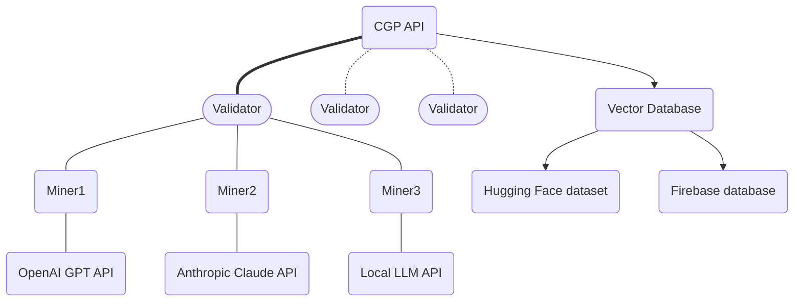
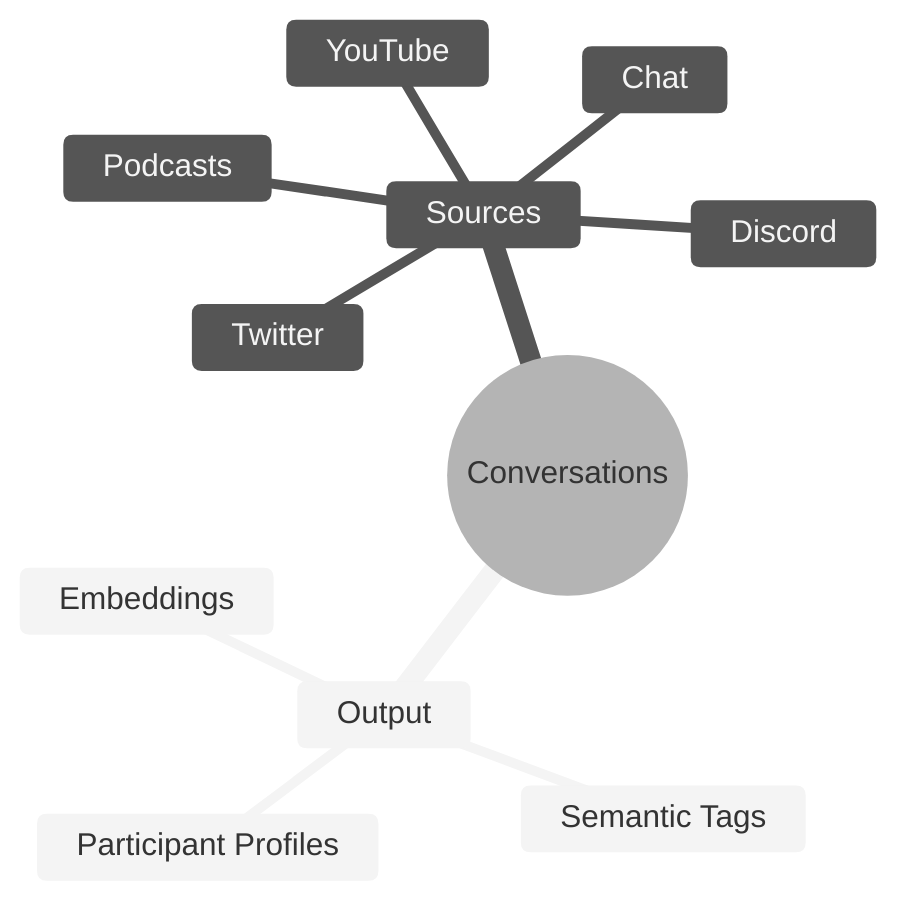

# **Conversation Genome Project** <!-- omit in toc -->
[](https://discord.gg/bittensor)
[](https://opensource.org/licenses/MIT)

---
- [Conversation Genome Project](#conversation-genome-project)
  - [Key Features](#key-features)
- [Getting Started]
  - Quickstart Local run
  - Quickstart Testnet run
  - Quickstart Main run
- [Conversation Genome Project Overview]
  - [Benefits](#benefits)
  - [System Design](#system-design)
  - [Rewards and Incentives](#rewards-and-incentives)
- [Setup](#setup)
- [Mining](#mining)
- [Validating](#validating)
- [License](#license)

---

# Introduction to the Conversation Genome Project

The Conversation Genome Project (CGP) is an open-source initiative aimed at enabling personalized conversational AI by providing a comprehensive dataset of indexed and tagged conversations.

If you are new to Bittensor, please checkout the [Bittensor Website](https://bittensor.com/) before proceeding to the setup section.



## Key Features

- Indexing and tagging of billions of conversations across various sources (YouTube, podcasts, etc.)
- Leveraging fractal data mining and conversation windows for efficient processing
- Synthetic participant profiles generated from conversation metadata
- Boring Index algorithm to assess conversation quality (relevance, engagement, novelty, coherence, and fluency)
- Open-source dataset for training and fine-tuning conversational AI models
- Incentivized mining and validation system for data contribution and integrity


# Quickstart Mock Tests

The best way to begin to understand the Conversation Genome (CG) is to run the unit tests. These tests are meant to provide verbose output so you can see how the process works. They also execute against mock data sources and APIs so you don't need to have anything set up in terms of keys, etc. to see how this operatates.

Clone the repo and install the requirements:

```console
git clone https://github.com/afterpartyai/bittensor-afterparty-conversation-genome-subnet.git ap-cg-subnet
pip install -r requirements.txt
cd ap-cg-subnet
```

Once this is setup, let's run the Miner, so you can watch the process at work:

```console
python -m unittest discover tests_ap testminer
```

You can follow the output to see the miner executes the following flow:

* Receive a conversation from the validator
* Process the conversation which will generate 3 main sets of data about the conversation:
** Participant Profiles of each participant in the conversation
** Semantic tags for different aspects of the conversation
** Vector embeddings of the semantic tags
* Return the processed data to the validator

The data generated is explained in detail in the Overview section below. The output should look something like this:

```
Mined 37 tags
......
----------------------------------------------------------------------
Ran 6 tests in 0.002s

OK
```

Let's run the validator tests which will make get a conversation, send the conversation to the miner, and validate the response.

```console
python -m unittest discover tests_ap testvalidator
```

The output will show the following execution flow:

* Establish a connection to the (mock) Conversation Server (CS)
* Download a (mock) conversation to process
* Send the conversation to a group of miners (3 in this test)
* Receive the processed responses
* Send each response to the CS and receive scopes for the tags and profile
* Divide the reward based on those scores
* Send for emissions

The output should look something like this:

```
Found 37 tags
Validating 37 tags
.............
----------------------------------------------------------------------
Ran 13 tests in 0.002s
OK
```

# Quickstart Configuration and API Tests

Now that you've seen the process execute, let's configure your instance and run the tests that verify everything is setup properly.

First duplicate the dotenv file:

```console
cp example.env .env
```

Use your editor to add your settings. You will need a ChatGPT key and a Bittensor hotkey. If you're on a Linux box, the nano editor is usually the easiest:

```console
nano .env
```

Once this is configured, run the config tester that will do a baseline test to make sure all of the proper variables are set:

```console
python -m unittest discover tests_ap testvalidator
```


If you have any reported errors in the .env and run again until all tests are finished. Now run the process tests. These will run outside the Bittensor network (so no emissions), but they will get a test conversation, process it using your OpenAI key, and report the results. That will make sure the process itself is running properly on your machine.

```console
python -m unittest discover tests_ap processtest
```

If everything is working properly, you are ready to run against the testnet. Simply run this file:

```console
bash run_testnet.sh
```

When you're ready to register and run on mainnet, use this file:

```console
bash run_mainnet.sh
```

# Conversation Genome Project Overview

Conversation Genome Project (CGP) use the Bittensor infrastructure the refine data related to conversations.

## Benefits

- Addresses the lack of personalization in current conversational AI models
- Enables natural and engaging conversations tailored to individual contexts and preferences
- Provides a comprehensive and annotated dataset for conversational AI development
- Encourages open-source community contributions and advancements
- Maintains data integrity through validation and scoring mechanisms

## System Design

- Data stores: Primary source of truth, conversation windows, participant profiles, and vector database
- Validator roles: Pull data, ground conversations, create windows, and score submissions
- Miner roles: Process conversation windows, provide metadata and tags
- Data flow: Ground truth establishment, window creation, miner submissions, scoring, and validation

## Rewards and Incentives

- Miners rewarded for accurate and valuable metadata contributions
- Bell curve distribution of rewards to encourage high-quality submissions
- Cross-referencing and vector space analysis to ensure data integrity
- Boring Index algorithm for assessing conversation quality (not yet used for miner rewards)


## Mining

You can launch your miners via pm2 using the following command.

`pm2 start ./miner/miner.py --interpreter python3 -- --netuid 18 --subtensor.network <LOCAL/FINNEY/TEST> --wallet.name <WALLET NAME> --wallet.hotkey <HOTKEY NAME> --axon.port <PORT>`


## Validating

You can launch your validator via pm2 using the following command.

`pm2 start ./validators/validator.py --interpreter python3 -- --netuid 18 --subtensor.network <LOCAL/FINNEY/TEST> --wallet.name <WALLET NAME> --wallet.hotkey <HOTKEY NAME>`





---
## Quickstarter template

This template contains all the required installation instructions, scripts, and files and functions for:
- Building Bittensor subnets.
- Creating custom incentive mechanisms and running these mechanisms on the subnets.

In order to simplify the building of subnets, this template abstracts away the complexity of the underlying blockchain and other boilerplate code. While the default behavior of the template is sufficient for a simple subnet, you should customize the template in order to meet your specific requirements.
---

## Introduction

**IMPORTANT**: If you are new to Bittensor subnets, read this section before proceeding to [Installation](#installation) section.

The Bittensor blockchain hosts multiple self-contained incentive mechanisms called **subnets**. Subnets are playing fields in which:
- Subnet miners who produce value, and
- Subnet validators who produce consensus

determine together the proper distribution of TAO for the purpose of incentivizing the creation of value, i.e., generating digital commodities, such as intelligence or data.

Each subnet consists of:
- Subnet miners and subnet validators.
- A protocol using which the subnet miners and subnet validators interact with one another. This protocol is part of the incentive mechanism.
- The Bittensor API using which the subnet miners and subnet validators interact with Bittensor's onchain consensus engine [Yuma Consensus](https://bittensor.com/documentation/validating/yuma-consensus). The Yuma Consensus is designed to drive these actors: subnet validators and subnet miners, into agreement on who is creating value and what that value is worth.

This starter template is split into three primary files. To write your own incentive mechanism, you should edit these files. These files are:
1. `template/protocol.py`: Contains the definition of the protocol used by subnet miners and subnet validators.
2. `neurons/miner.py`: Script that defines the subnet miner's behavior, i.e., how the subnet miner responds to requests from subnet validators.
3. `neurons/validator.py`: This script defines the subnet validator's behavior, i.e., how the subnet validator requests information from the subnet miners and determines the scores.

### Example

The Bittensor Subnet 1 for Text Prompting is built using this template. See [Bittensor Text-Prompting](https://github.com/opentensor/text-prompting) for how to configure the files and how to add monitoring and telemetry and support multiple miner types. Also see this Subnet 1 in action on [Taostats](https://taostats.io/subnets/netuid-1/) explorer.

---

## Installation

### Before you proceed
Before you proceed with the installation of the subnet, note the following:

- Use these instructions to run your subnet locally for your development and testing, or on Bittensor testnet or on Bittensor mainnet.
- **IMPORTANT**: We **strongly recommend** that you first run your subnet locally and complete your development and testing before running the subnet on Bittensor testnet. Furthermore, make sure that you next run your subnet on Bittensor testnet before running it on the Bittensor mainnet.
- You can run your subnet either as a subnet owner, or as a subnet validator or as a subnet miner.
- **IMPORTANT:** Make sure you are aware of the minimum compute requirements for your subnet. See the [Minimum compute YAML configuration](./min_compute.yml).
- Note that installation instructions differ based on your situation: For example, installing for local development and testing will require a few additional steps compared to installing for testnet. Similarly, installation instructions differ for a subnet owner vs a validator or a miner.

### Install

- **Running locally**: Follow the step-by-step instructions described in this section: [Running Subnet Locally](./docs/running_on_staging.md).
- **Running on Bittensor testnet**: Follow the step-by-step instructions described in this section: [Running on the Test Network](./docs/running_on_testnet.md).
- **Running on Bittensor mainnet**: Follow the step-by-step instructions described in this section: [Running on the Main Network](./docs/running_on_mainnet.md).

---

## Writing your own incentive mechanism

As described in [Quickstarter template](#quickstarter-template) section above, when you are ready to write your own incentive mechanism, update this template repository by editing the following files. The code in these files contains detailed documentation on how to update the template. Read the documentation in each of the files to understand how to update the template. There are multiple **TODO**s in each of the files identifying sections you should update. These files are:
- `template/protocol.py`: Contains the definition of the wire-protocol used by miners and validators.
- `neurons/miner.py`: Script that defines the miner's behavior, i.e., how the miner responds to requests from validators.
- `neurons/validator.py`: This script defines the validator's behavior, i.e., how the validator requests information from the miners and determines the scores.
- `template/forward.py`: Contains the definition of the validator's forward pass.
- `template/reward.py`: Contains the definition of how validators reward miner responses.

In addition to the above files, you should also update the following files:
- `README.md`: This file contains the documentation for your project. Update this file to reflect your project's documentation.
- `CONTRIBUTING.md`: This file contains the instructions for contributing to your project. Update this file to reflect your project's contribution guidelines.
- `template/__init__.py`: This file contains the version of your project.
- `setup.py`: This file contains the metadata about your project. Update this file to reflect your project's metadata.
- `docs/`: This directory contains the documentation for your project. Update this directory to reflect your project's documentation.

__Note__
The `template` directory should also be renamed to your project name.
---

# Writing your own subnet API
To leverage the abstract `SubnetsAPI` in Bittensor, you can implement a standardized interface. This interface is used to interact with the Bittensor network and can is used by a client to interact with the subnet through its exposed axons.

What does Bittensor communication entail? Typically two processes, (1) preparing data for transit (creating and filling `synapse`s) and (2), processing the responses received from the `axon`(s).

This protocol uses a handler registry system to associate bespoke interfaces for subnets by implementing two simple abstract functions:
- `prepare_synapse`
- `process_responses`

These can be implemented as extensions of the generic `SubnetsAPI` interface.  E.g.:


This is abstract, generic, and takes(`*args`, `**kwargs`) for flexibility. See the extremely simple base class:
```python
class SubnetsAPI(ABC):
    def __init__(self, wallet: "bt.wallet"):
        self.wallet = wallet
        self.dendrite = bt.dendrite(wallet=wallet)

    async def __call__(self, *args, **kwargs):
        return await self.query_api(*args, **kwargs)

    @abstractmethod
    def prepare_synapse(self, *args, **kwargs) -> Any:
        """
        Prepare the synapse-specific payload.
        """
        ...

    @abstractmethod
    def process_responses(self, responses: List[Union["bt.Synapse", Any]]) -> Any:
        """
        Process the responses from the network.
        """
        ...

```


Here is a toy example:

```python
from bittensor.subnets import SubnetsAPI
from MySubnet import MySynapse

class MySynapseAPI(SubnetsAPI):
    def __init__(self, wallet: "bt.wallet"):
        super().__init__(wallet)
        self.netuid = 99

    def prepare_synapse(self, prompt: str) -> MySynapse:
        # Do any preparatory work to fill the synapse
        data = do_prompt_injection(prompt)

        # Fill the synapse for transit
        synapse = StoreUser(
            messages=[data],
        )
        # Send it along
        return synapse

    def process_responses(self, responses: List[Union["bt.Synapse", Any]]) -> str:
        # Look through the responses for information required by your application
        for response in responses:
            if response.dendrite.status_code != 200:
                continue
            # potentially apply post processing
            result_data = postprocess_data_from_response(response)
        # return data to the client
        return result_data
```

You can use a subnet API to the registry by doing the following:
1. Download and install the specific repo you want
1. Import the appropriate API handler from bespoke subnets
1. Make the query given the subnet specific API


See a simplified example for subnet 21 (`FileTao` storage) below. See `examples/subnet21.py` file for a full implementation example to follow:

```python

# Subnet 21 Interface Example

class StoreUserAPI(SubnetsAPI):
    def __init__(self, wallet: "bt.wallet"):
        super().__init__(wallet)
        self.netuid = 21

    def prepare_synapse(
        self,
        data: bytes,
        encrypt=False,
        ttl=60 * 60 * 24 * 30,
        encoding="utf-8",
    ) -> StoreUser:
        data = bytes(data, encoding) if isinstance(data, str) else data
        encrypted_data, encryption_payload = (
            encrypt_data(data, self.wallet) if encrypt else (data, "{}")
        )
        expected_cid = generate_cid_string(encrypted_data)
        encoded_data = base64.b64encode(encrypted_data)

        synapse = StoreUser(
            encrypted_data=encoded_data,
            encryption_payload=encryption_payload,
            ttl=ttl,
        )

        return synapse

    def process_responses(
        self, responses: List[Union["bt.Synapse", Any]]
    ) -> str:
        for response in responses:
            if response.dendrite.status_code != 200:
                continue
            stored_cid = (
                response.data_hash.decode("utf-8")
                if isinstance(response.data_hash, bytes)
                else response.data_hash
            )
            bt.logging.debug("received data CID: {}".format(stored_cid))
            break

        return stored_cid


class RetrieveUserAPI(SubnetsAPI):
    def __init__(self, wallet: "bt.wallet"):
        super().__init__(wallet)
        self.netuid = 21

    def prepare_synapse(self, cid: str) -> RetrieveUser:
        synapse = RetrieveUser(data_hash=cid)
        return synapse

    def process_responses(self, responses: List[Union["bt.Synapse", Any]]) -> bytes:
        success = False
        decrypted_data = b""
        for response in responses:
            if response.dendrite.status_code != 200:
                continue
            decrypted_data = decrypt_data_with_private_key(
                encrypted_data,
                response.encryption_payload,
                bytes(self.wallet.coldkey.private_key.hex(), "utf-8"),
            )
        return data


Example usage of the `FileTao` interface, which can serve as an example for other subnets.

# import the bespoke subnet API
from storage import StoreUserAPI, RetrieveUserAPI

wallet = bt.wallet(wallet="default", hotkey="default") # the wallet used for querying
metagraph = bt.metagraph(netuid=21)  # metagraph of the subnet desired
query_axons = metagraph.axons... # define custom logic to retrieve desired axons (e.g. validator set, specific miners, etc)

# Store the data on subnet 21
bt.logging.info(f"Initiating store_handler: {store_handler}")
cid = await StoreUserAPI(
      axons=query_axons, # the axons you wish to query
      # Below: Parameters passed to `prepare_synapse` for this API subclass
      data=b"Hello Bittensor!",
      encrypt=False,
      ttl=60 * 60 * 24 * 30,
      encoding="utf-8",
      uid=None,
)
# The Content Identifier that corresponds to the stored data
print(cid)
> "bafkreifv6hp4o6bllj2nkdtzbq6uh7iia6bgqgd3aallvfhagym2s757v4

# Now retrieve data from SN21 (storage)
data = await RetrieveUserAPI(
  axons=query_axons, # axons desired to query
  cid=cid, # the content identifier to fetch the data
)
print(data)
> b"Hello Bittensor!"
```


# Subnet Links
In order to see real-world examples of subnets in-action, see the `subnet_links.py` document or access them from inside the `template` package by:
```python
import template
template.SUBNET_LINKS
[{'name': 'sn0', 'url': ''},
 {'name': 'sn1', 'url': 'https://github.com/opentensor/text-prompting/'},
 {'name': 'sn2', 'url': 'https://github.com/bittranslateio/bittranslate/'},
 {'name': 'sn3', 'url': 'https://github.com/gitphantomman/scraping_subnet/'},
 {'name': 'sn4', 'url': 'https://github.com/manifold-inc/targon/'},
...
]
```

## License
This repository is licensed under the MIT License.
```text
# The MIT License (MIT)
# Copyright © 2023 Yuma Rao

# Permission is hereby granted, free of charge, to any person obtaining a copy of this software and associated
# documentation files (the “Software”), to deal in the Software without restriction, including without limitation
# the rights to use, copy, modify, merge, publish, distribute, sublicense, and/or sell copies of the Software,
# and to permit persons to whom the Software is furnished to do so, subject to the following conditions:

# The above copyright notice and this permission notice shall be included in all copies or substantial portions of
# the Software.

# THE SOFTWARE IS PROVIDED “AS IS”, WITHOUT WARRANTY OF ANY KIND, EXPRESS OR IMPLIED, INCLUDING BUT NOT LIMITED TO
# THE WARRANTIES OF MERCHANTABILITY, FITNESS FOR A PARTICULAR PURPOSE AND NONINFRINGEMENT. IN NO EVENT SHALL
# THE AUTHORS OR COPYRIGHT HOLDERS BE LIABLE FOR ANY CLAIM, DAMAGES OR OTHER LIABILITY, WHETHER IN AN ACTION
# OF CONTRACT, TORT OR OTHERWISE, ARISING FROM, OUT OF OR IN CONNECTION WITH THE SOFTWARE OR THE USE OR OTHER
# DEALINGS IN THE SOFTWARE.
```
