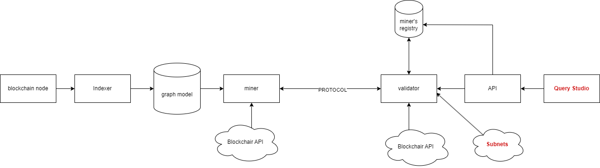

# The Blockchain Insights Subnet - High Level Architecture

## System Context

### MINERS
- Miners in the Blockchain Insights subnet are tasked with the crucial job of transforming raw blockchain data into structured graph models. These models are not limited to simple transactions; they extend to encompass DeFi protocol transactions and NFT exchanges, providing a comprehensive view of asset flow. The funds flow graph model is a prime example of their work, offering a detailed visualization of monetary movements between various addresses or accounts. Through these models, miners enable the network to map and scrutinize the complex web of blockchain interactions.

### PROTOCOL
- The protocol is a defined set of rules for data exchange between miners and validators in the Blockchain Insights subnet. It governs how miners serve data in response to queries from validators, APIs, or other subnets. This protocol delineates the data contract, specifying the structure and format of data to be exchanged, ensuring consistency and interoperability within the network's operations.

### Validators
- Within the blockchain insights subnet, validators perform a crucial, multifaceted role. They act as a proxy, efficiently routing queries between miners, other subnets, and APIs. In addition to this intermediary function, validators are responsible for grouping miners. This grouping is based on the specific blockchain domains and graph model types that the miners specialize in, optimizing the subnet's query handling capabilities. Moreover, validators rank these miners, taking into account the correctness and performance of the data they provide. This ranking ensures that the subnet maintains high standards of data quality and performance, thereby upholding the overall integrity and reliability of the blockchain insights generated.

### Subnets
- Subnets are distinct segments of the Bittensor network, each able to query and interact with the blockchain insights subnet for specific data and analytical purposes.

### Query Studio
- Query Studio is a user-friendly application in the Blockchain Insights subnet for executing data analytics queries and visualizing results.

### Users
- End-users or clients interacting with the Blockchain Insights subnet, through interfaces like the Query Studio or API.

## Container Diagram

### Blockchain Node
- Maintains a copy of the blockchain, processes transactions, and participates in consensus mechanisms.

### Indexer
- The Indexer is a component that processes blockchain data, converting it into graph-based models for enhanced query capabilities. It serves as a bridge between raw data and structured insights, enabling complex data analysis within the blockchain insights subnet.

### Graph Model - Memgraph and MAGE
- The Graph Model in the blockchain insights subnet leverages Memgraph, an in-memory graph database that supports the creation of snapshots on disk. This enables the execution of Cypher queries, which are used to interrogate the graph database, allowing for complex data relationship analysis and insights.
- Memgraph Advanced Graph Extensions, or MAGE, is a vital addition to this system. It is an open-source library of graph algorithms that aims to become a leading solution in the field by providing a user-friendly interface across multiple programming languages​​. MAGE facilitates the extension of graph database functionalities, enabling users to quickly implement a wide range of graph algorithms essential for advanced analytics​​.
- Furthermore, MAGE can leverage the GPU for accelerated execution of graph algorithms when used with the Memgraph X NVIDIA cuGraph version of the library, which enhances performance significantly, especially for large-scale graph analytics​​. This feature is particularly relevant for operations that require intensive computation, like those needed for analyzing blockchain data.
- By integrating MAGE, the blockchain insights subnet can benefit from the shared innovations of developers through custom Cypher procedures, which enrich the community's analytical capabilities​​. The use of NVIDIA GPU support with Memgraph makes it a robust solution for processing and analyzing real-time data streams in the blockchain insights subnet, ensuring fast and efficient data handling.

### Miner
- Serves as the data provider to validators through a predefined PROTOCOL. Miners can be of various types, differentiated by the specific blockchain they support and the graph model types they employ. This versatility allows Miners to handle a diverse range of data requests, catering to the unique requirements of different blockchain networks and analytics demands. By aligning their capabilities with the graph models, Miners ensure that validators have access to the precise data needed, facilitating accurate and efficient data validation and analysis within the blockchain insights subnet.

### PROTOCOL 
- The protocol within the blockchain insights subnet is a set of rules facilitating data exchange between miners and validators. It allows miners to serve data in response to queries originating from validators, APIs, or other subnets. This protocol outlines the specific data contract, which includes the structure and format of the data to be exchanged, ensuring consistency and effective communication within the network. The protocol's design is crucial for maintaining the integrity and efficiency of data transfer in the subnet.

### Validator
- Within the blockchain insights subnet, the role of the validator is multifaceted. Validators act as a routing layer, directing queries between the API, subnets, and miners. They are responsible for organizing miners into groups based on their area of blockchain specialization and the types of graph models they handle. Additionally, validators rank miners by the accuracy and performance of their data contributions. This ranking is key to maintaining the subnet's standard for data quality and efficiency, ensuring the reliability of the insights provided. Through these activities, validators uphold the subnet's data integrity and streamline the flow of information.

### Miner's Registry
- The Miner's Registry is a database residing on the validator's side within the blockchain insights subnet. Its primary function is to keep track of the various miners, organizing them by the specific blockchain networks they support and the graph models they are capable of handling. This organization enables validators to efficiently manage and allocate data requests to the appropriate miners based on their specialties, ensuring that the data served is relevant and up to the validators' requirements for accuracy and performance. The Miner's Registry is a critical component in maintaining the integrity of the subnet's operations, enabling a structured and systematic approach to handling the flow of blockchain data.

### Blockchair API
- The Blockchair API is a search and analytics engine that provides access to data across 17 blockchains, supporting complex queries for detailed analysis. It is used within the blockchain insights subnet to validate miner outputs, ensuring data accuracy and integrity.

### API
- The API in the blockchain insights subnet serves as a gateway for executing Cypher queries on the data provided by miners. Requests made through the API are routed by the validator to the appropriate miners based on their registered capabilities in the Miner's Registry. This ensures that queries are handled efficiently and by the most suitable data source. The API offers a range of predefined queries for common tasks and analytics, as well as a Cypher endpoint that allows users to execute custom queries. This dual functionality facilitates both standard and bespoke data analysis, making the API a versatile tool for accessing and interrogating the wealth of information within the subnet.

### SUBNETS
- In the blockchain insights subnet, subnets represent interconnected segments of the broader Bittensor network. Each subnet has the capability to query the blockchain insights subnet for specific data and insights. These subnets facilitate specialized interactions and data exchanges within the network, allowing for targeted analytics and information retrieval tailored to their unique requirements.

### Query Studio
- Query Studio is a WPF (Windows Presentation Foundation) analytical application designed for end users to perform queries against the data served by miners. It provides a user interface that allows for the execution of complex queries, facilitating the analysis and visualization of blockchain data directly on the Windows platform.