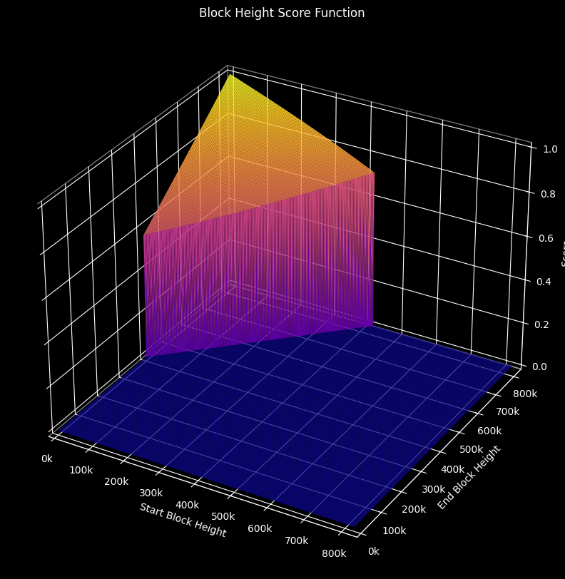
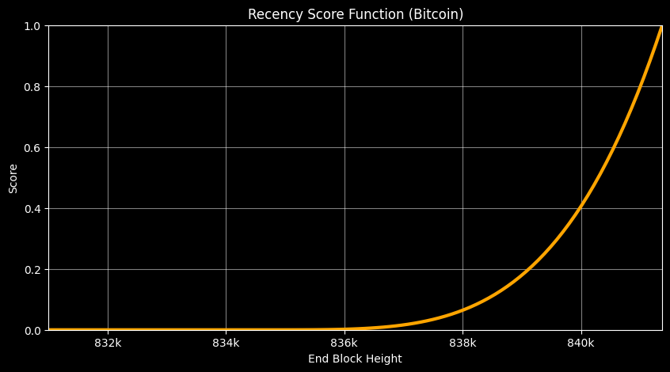
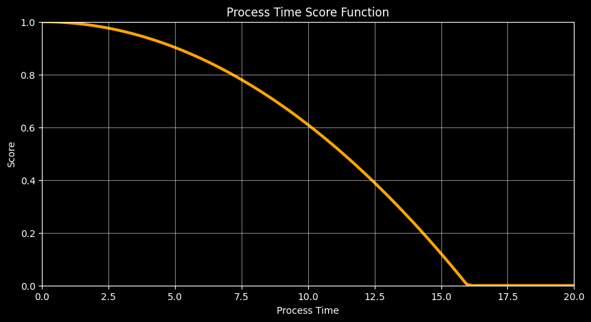
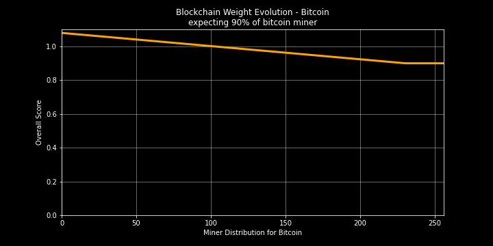

# Blockchain Insight Scoring Function

### Scoring Function Overview

Our scoring function is designed to provide a comprehensive evaluation of blockchain data through four key metrics:

- **Block Height Coverage ($s_{1}$):** Indicates the percentage of block coverage, offering insights into the comprehensiveness of the blockchain data.

- **Recency of Block ($s_{2}$):** Reflects the recency of the most recent block, helping users gauge the timeliness of the blockchain data.

- **Response Time ($s_{3}$):** Measures the time it takes to respond, serving as a crucial indicator of the blockchain's efficiency and responsiveness.

- **Weight Based on the Mined Blockchain ($s_{4}$):** Considers the specific blockchain mined (e.g., bitcoin, doge, etc.), providing contextual relevance to the scoring process.

### Scoring Formula

The overall score is determined by the weighted sum of these four scores, where $w_i$ represents the weight assigned to each respective metric. The formula is expressed as:

$$
\text{score} = \frac{\sum_{i=1}^{4} w_{i} \cdot s_{i}}{\sum_{i=1}^{4} w_{i}}$$

This formula encapsulates the essence of our scoring mechanism, offering a balanced and informative evaluation of blockchain insights.

### Weight Assignments

Currently, the weights are as follows:

- $(w_{1} = 88)$: Block Height Coverage
- $(w_{2} = 5)$: Recency of Block
- $(w_{3} = 5)$: Response Time
- $(w_{4} = 2)$: Weight Based on the Mined Blockchain (bitcoin, doge, etc.)

In other words, to achieve the highest possible score, a miner should index a broad range of recent blocks from a significant blockchain (such as bitcoin) and respond promptly.

### Important Notes:

It's crucial to be aware that:

- A range of blocks less than 51480 will result in a score of 0.

- A response time exceeding 128 seconds will result in a score of 0.

## Deep Dive

### Scoring Function Implementation

Our scoring function is implemented through a set of Python functions to assess various aspects of blockchain data. Let's break down how each component contributes to the overall score.

#### Block Height Coverage ($s_{1}$) Calculation

The `Block Height Coverage` function evaluates the coverage of indexed blocks within a blockchain. It considers the number of blocks covered, the minimum required blocks. The final score is a combination of coverage percentage and recency score.

The graph below illustrate the function:

  

#### Recency of Block ($s_{2}$) Calculation

`Recency of Block` measures the difference between the indexed end block height and the current blockchain block height. The final recency score is based on this difference.

The graph below illustrate the function:

  

#### Response Time ($s_{3}$) Calculation

The `Response Time` function calculates the response time score based on the process time and discovery timeout. It considers the ratio of process time to timeout and squares it to emphasize the impact of longer processing times.

The graph below illustrate the function:

  

#### Weight Based on the Mined Blockchain ($s_{4}$) Calculation

The `Weight Based on the Mined Blockchain` function assigns a weight to the blockchain based on its importance and distribution among miners. The overall score is a combination of the network's importance and the distribution score.

The graph below illustrate the function:

  

----

In summary, the scoring function evaluates blockchain data based on the coverage, recency, response time, and the significance of the mined blockchain to provide a comprehensive and informative score.